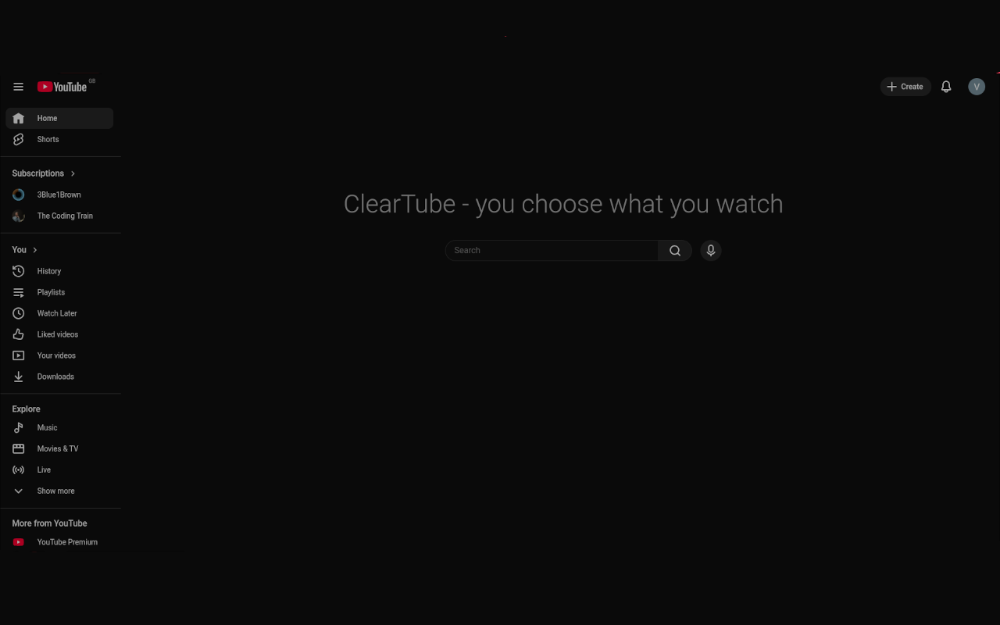

# ClearTube

> You choose what to watch, not algorithms.

ClearTube is a Chrome extension that replaces the YouTube homepage feed with a clean, minimal search page — so you only watch what you actually came for.

## What it does

- Hides the algorithm-driven homepage feed
- Centers the search bar on the homepage
- Restores everything when you navigate away from home
- Zero data collection, zero network requests

## Installation

### From Chrome Web Store
*Coming soon.*

### Manual (developer mode)
1. Clone this repo
2. Go to `chrome://extensions`
3. Enable **Developer mode** (top right)
4. Click **Load unpacked** and select the folder

## Screenshots

## Privacy

ClearTube collects no user data and makes no network requests. See [PRIVACY.md](PRIVACY.md).

## License

MIT
